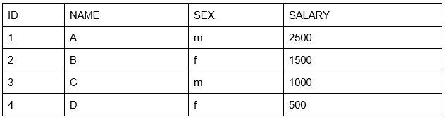

### DB_Table

Given a table SALARIES, such as the one below, that has m = male and f = female values. Swap all f and m values (i.e., change all f values to m and vice versa) with a single update query and no intermediate temp table